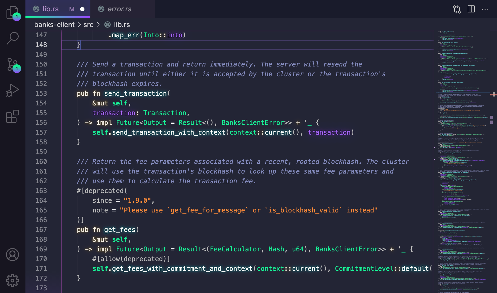
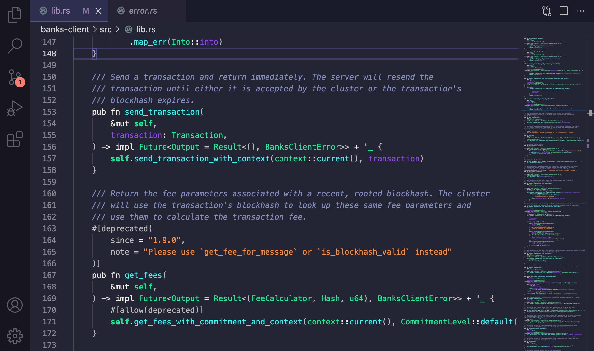

# Solana Beach '22 - VS Code theme


Do you remember that endless summer back in '21? Cruising down Solana Beach with the top down, the wind in our hair and heads buzzing with DeFi dreams? 

No, I don't remember it either, but with this experimental theme we can go there. 

This theme is a fork of the awesome SynthWave '84 theme. Much thanks to Robb Owen for this.

__As of v0.1.15, no external extensions or dependencies are needed to activate the glow effect!__



This colour scheme is influenced by the Solana homepage and those awesome Sunglasses.

## But...why?
Because we deserve a theme.

## Installation
To begin with, [install the base theme from the VS Marketplace](https://marketplace.visualstudio.com/items?itemName=zfedoran.solanabeach-vscode). This is the way SolanaBeach '22 is intended to be used day-to-day. If you want to enable the gratuitous 80s glow, it needs a little extra work to get it going. 

### Disclaimer
VS code doesn't natively support text effects and as a result, the glow is experimental. It's likely to be buggy and, whilst it looks rad, it isn't intended for extended use. To enable the glow, the extension has to modify the internal files of VS Code, so use with caution. Should something go wrong, you can disable the glow by following the instructions below. If for any reason you can't open VS Code, you can fix the issue with a fresh install of VS Code.

If you do decide use the glow effect, you do so at your own risk. Bring your Sunglasses. Here be (laser)dragons.

### To enable the glow
As of v0.1.0, external extensions are no longer needed to active the glow. 

Firstly, if you are a Windows user, you may need to run VS Code with administrator privileges. For Linux and Mac users, Code must not be installed in a read-only location and you must have write permissions.

If you have been using SolanaBeach prior to v0.1.0, you will likely have used the Custom CSS and JS extension to enable the glow. Before enabling Neon Dreams, you will need to disable the prior method. You can do this by pressing `Ctrl + Shift + P` or `Shift + ⌘ + P` and choose "__Disable Custom CSS and JS__"

To activate the glow, Set your active colour theme to SolanaBeach '22 - as of v0.1.0 the glow is only active when the base theme is selected. Open your command palette with `Ctrl + Shift + P` or `Shift + ⌘ + P` and choose "__Enable Neon Dreams__". It will prompt you to restart, and when you do the lights should be on :)

Note: In the name of simplifying the install process and mitigating update-related issues, the new version of SolanaBeach '22 doesn't use a custom CSS file anymore. _If you have been using a custom-modified version of the theme, then you can still continue to use that with the previous Custom CSS and JS method_.

#### To customise the glow brightness
In your `settings.json` add the key:
```
"solanabeach22.brightness": 0.45
```
The value should be a _float value_ from 0 to 1, where 0.0 is fully transparent. The default brightness is 0.45. To avoid eye strain, avoid using higher brightness values for extended periods of time. 

To see the changes, you need to rerun the activation function. Open your command palette with `Ctrl + Shift + P` or `Shift + ⌘ + P` and choose "__Enable Neon Dreams__".

Note: Changing the brightness currently only affects the opacity of the glow, the text will remain white (that may change in future updates). If you want to disable the glow effect but retain the chrome updates, see below.

#### To enable editor chrome updates, but disable glow
In your `settings.json` add the key:
```
"solanabeach22.disableGlow": true
```
To see the changes, you need to rerun the activation function. Open your command palette with `Ctrl + Shift + P` or `Shift + ⌘ + P` and choose "__Enable Neon Dreams__".

### To remove corruption warning and [unsupported] from title-bar
Because enabling the glow modifies core files, VS code will interpret this as the core being 'corrupted' and you may see an error message on restarting your editor. You can safely dismiss this message, or remove it entirely with the [Fix VSCode Checksums](https://marketplace.visualstudio.com/items?itemName=lehni.vscode-fix-checksums 'Fix VSCode Checksums') extension.

Upon installation of 'Fix VSCode Checksums', open the command palette and execute `Fix Checksums: Apply`. You will need to completely restart VSCode after execution, reopening without fully exiting might not be enough.

## Updates
Every time you update VS code, you will need to repeat this step to re-enable the glow.

## Disabling the glow and uninstallation
The glow effect started as a joke and was never intended for long-term coding sessions. If you want to turn it off, you can disable it at any time by opening your command palette with `Ctrl + Shift + P` or `Shift + ⌘ + P` and choose "__Disable Neon Dreams__".

### Font
I haven't included a font in this release as I know that it's a very personal preference. The font I use (that is seen in the image above) is [Fira Code](https://github.com/tonsky/FiraCode), which I recommend if you're a fan of ligatures.

## Compatibility
This theme is still **very much a work in progress**. I primarily develop in Rust, Go, and Node so, whilst those language sets should look pretty good, there will likely be issues for other languages. I'll work on adding more support as I go. If you find anything glaringly wrong, raise an issue and I'll try to fix it as soon as I can.

## Without Neon
The theme is designed to work without neon enabled. Here is an example.




## Contributing
I'm really happy to consider any contributions to this theme. Before you make any changes, [please read the contribution guide](https://github.com/zfedoran/solanabeach-vscode/blob/master/CONTRIBUTING.md).

## Thanks
This repository is a fork from Robb Owen's Theme. I couldn't have made this if it weren't for his work.
